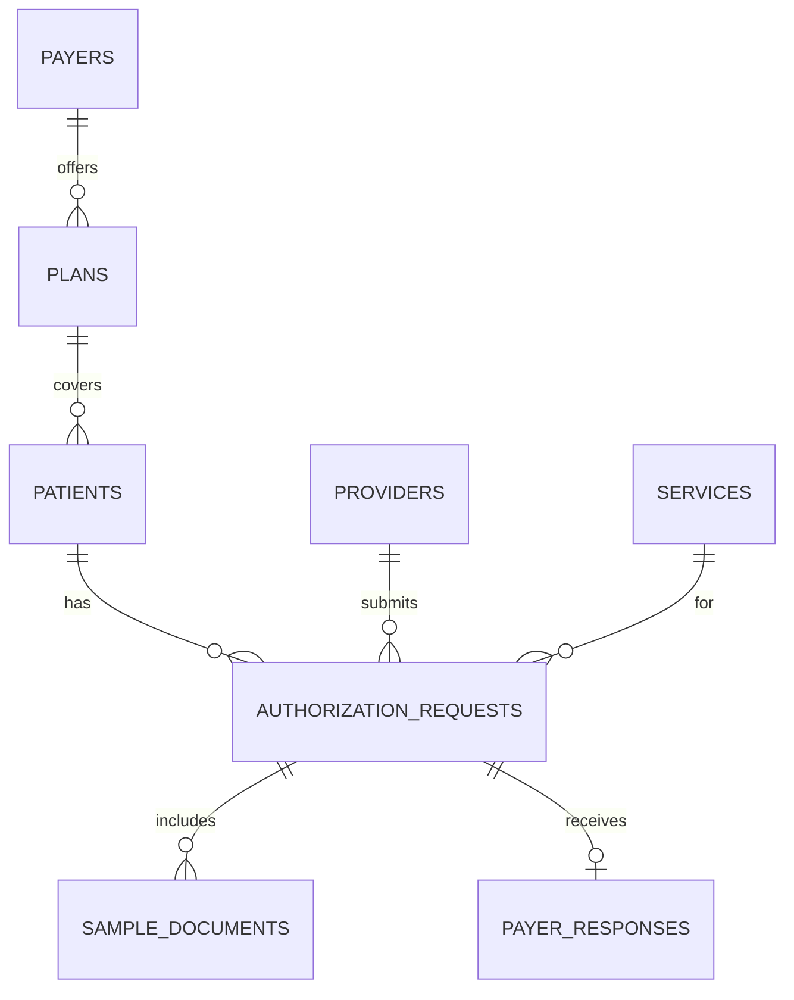

# Data Dictionary

## Table: PATIENTS
| Field | Type | Constraints | Description | Examples |
|-------|------|-------------|-------------|----------|
| id | UUID | PK | Unique identifier | 123e4567-e89b... |
| first_name | VARCHAR(100) | Not Null | First Name | John |
| last_name | VARCHAR(100) | Not Null | Last Name | Doe |
| dob | DATE | Not Null | Date of Birth | 1980-01-01 |
| gender | VARCHAR(20) | | Gender | M, F, O |
| member_id | VARCHAR(50) | Unique | Payer member ID | MEM123456 |

## Table: PROVIDERS
| Field | Type | Constraints | Description |
|-------|------|-------------|-------------|
| id | UUID | PK | Provider ID |
| npi | VARCHAR(20) | Unique | National Provider Identifier |
| name | VARCHAR(255) | Not Null | Full facility or practitioner name |
| specialty | VARCHAR(100) | | Primary specialty |

## Table: PAYERS
| Field | Type | Constraints | Description |
|-------|------|-------------|-------------|
| id | UUID | PK | Payer ID |
| name | VARCHAR(255) | Not Null | Payer organization name |
| payer_code | VARCHAR(50) | Unique | Standardized payer code |

## Table: PLANS
| Field | Type | Constraints | Description |
|-------|------|-------------|-------------|
| id | UUID | PK | Plan ID |
| payer_id | UUID | FK | Reference to PAYERS |
| name | VARCHAR(255) | Not Null | Plan Name (e.g., Bronze PPO) |
| pa_rules_summary | VARIANT | | JSON structure defining specific PA rules |

## Table: SERVICES
| Field | Type | Constraints | Description |
|-------|------|-------------|-------------|
| id | UUID | PK | Service ID |
| code | VARCHAR(20) | Not Null | CPT or HCPCS Code |
| description | TEXT | | Description of the service |

## Table: AUTHORIZATION_REQUESTS
| Field | Type | Constraints | Description |
|-------|------|-------------|-------------|
| id | UUID | PK | Request ID |
| patient_id | UUID | FK | Reference to PATIENTS |
| provider_id | UUID | FK | Reference to PROVIDERS |
| service_id | UUID | FK | Reference to SERVICES |
| status | VARCHAR(50) | Not Null | Enum: AuthorizationStatus |
| created_at | TIMESTAMP | | Record creation time |
| edge_case_type| VARCHAR(50) | | Enum: EdgeCaseType |

## Table: SAMPLE_DOCUMENTS
| Field | Type | Constraints | Description |
|-------|------|-------------|-------------|
| id | UUID | PK | Document ID |
| auth_request_id| UUID| FK | Associated PA request |
| doc_type | VARCHAR(50) | Not Null | Enum: DocumentType |
| s3_url | TEXT | Not Null | Cloud storage link |

## Table: PAYER_RESPONSES
| Field | Type | Constraints | Description |
|-------|------|-------------|-------------|
| id | UUID | PK | Response ID |
| auth_request_id| UUID | FK | Associated PA request |
| response_type | VARCHAR(50) | Not Null | Enum: ResponseType |
| details | VARIANT | | JSON response payload from payer |

## Table: AUDIT_LOGS
| Field | Type | Constraints | Description |
|-------|------|-------------|-------------|
| id | UUID | PK | Audit entry ID |
| entity_type | VARCHAR(50) | Not Null | e.g., AUTHORIZATION_REQUEST |
| entity_id | UUID | Not Null | The specific record ID |
| action | VARCHAR(50) | Not Null | CREATE, UPDATE, DELETE |
| changed_by | UUID | FK | User who performed the action |
| timestamp | TIMESTAMP | Not Null | When the action occurred |

## Enum Definitions
- **AuthorizationStatus**: DRAFT, SUBMITTED, PENDING_REVIEW, PENDING_INFO, APPROVED, DENIED, APPEALED, DENIED_FINAL
- **EdgeCaseType**: STANDARD, EMERGENCY_RETRO, NEWBORN, COB, DENIAL_APPEAL, CLINICAL_CHANGE
- **Priority**: LOW, NORMAL, HIGH, URGENT
- **DocumentType**: CLINICAL_NOTE, IMAGING, LAB_RESULT, PRESCRIPTION, OTHER
- **ResponseType**: APPROVED, DENIED, MORE_INFO_NEEDED, PENDING

## Relationship Diagram

*Note on approval mapping: No separate Approval table exists. The decision state is stored on Authorization_Requests (status) and mirrored in Payer_Responses.*
