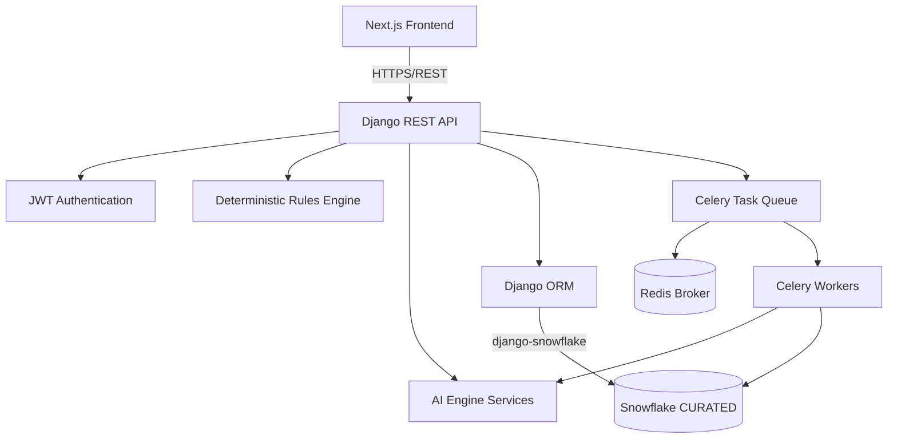
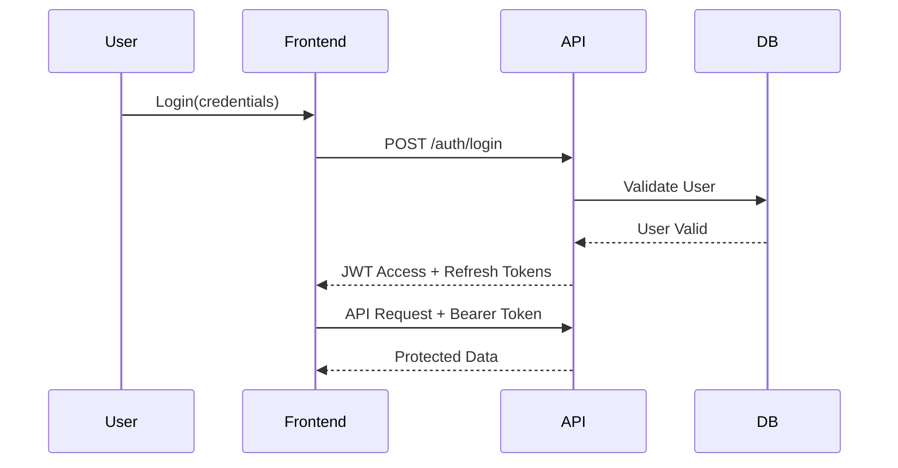
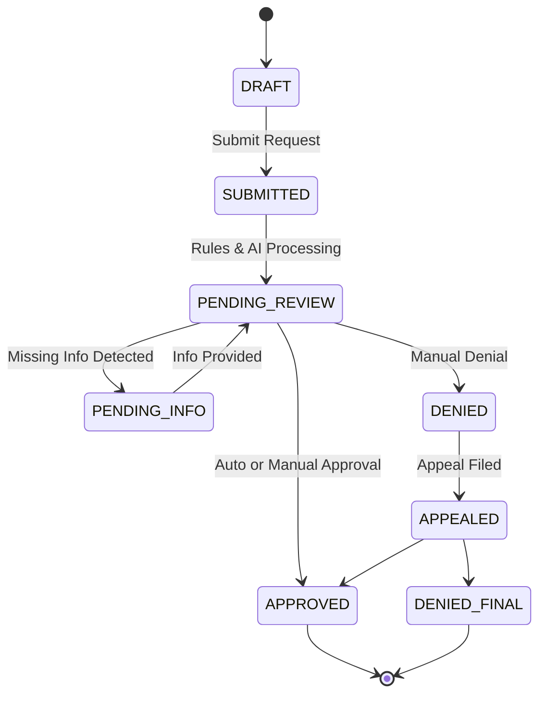

# System Architecture

## 1. System Overview
PA360 is an intelligent prior authorization platform designed to streamline the authorization workflow by integrating business rules, AI-driven document analysis, and human-in-the-loop review processes.

## 2. Component Architecture Diagram

## 3. Data Flow Diagram
- Providers submit Auth Requests and Upload Documents via the Frontend.
- Requests pass through the API to the DB.
- Async tasks trigger the Rules Engine and AI Engine to pre-process requests.
- Results are stored in the DB and status updates are sent to the Frontend.

## 4. Authentication Flow

## 5. 12-Step PA Workflow

## 6. AI Engine Architecture
The AI Engine uses foundational models (via OpenAI/Gemini APIs) wrapped with a confidence scoring layer. It extracts key entities from documents and matches them against required clinical criteria, passing uncertain predictions to human specialists.

## 7. Edge Case Routing
- Emergency/Retro-Auth: Expedited routing skipping initial standard wait times.
- Newborn/New-Enrollee: Bypasses standard eligibility checks if provisional data is linked.
- Approved-Not-Covered / Denial-Appeal / Clinical-Change / COB: Specialized exception queues.

## 8. Technology Stack Table
| Component | Technology |
|-----------|------------|
| Frontend | Next.js 16, TypeScript, Tailwind |
| Backend | Django 5.2, DRF, Celery |
| Database | Snowflake |
| Caching/Queue | Redis |
| AI | LangChain / Foundation Models |
